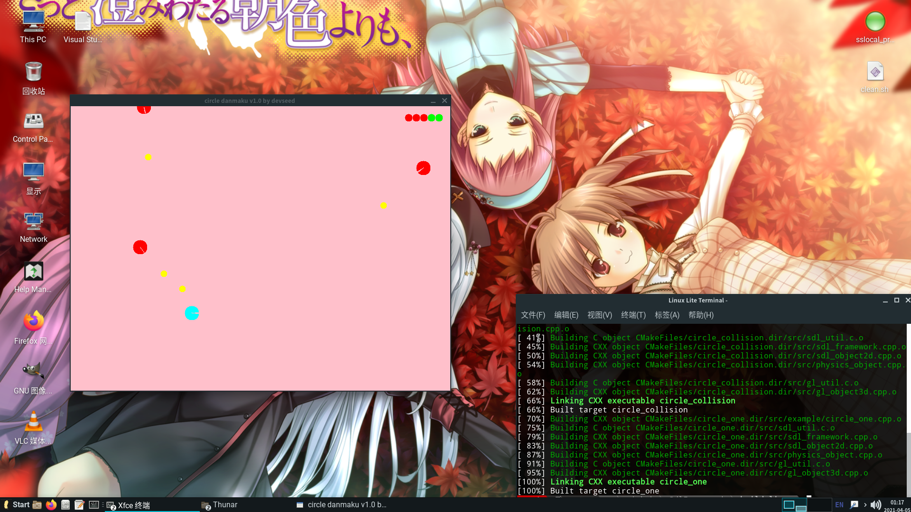
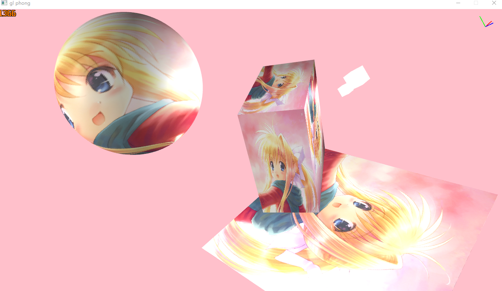

# SdlFramework
My simple SDL framework for rendering, updating and event handling.

## 1. Structures

### (1) SDL  part

Currently the class is as below:

**sdl_framework.hpp**

`CAppSDL`:  create window and renderer, contain the global information

`CStageManagerSDL`: manage the game stage, a stage can be a level or menu,  define how to change stage here

`CStageSDL`:  a stage contains many scenes in a level and handles the event if change scene.

`CSceneSDL`: a scene contains many objects and determine how objects interact with each other

**sdl_object2d.hpp**

`CObject2DSDL`: a object used for SDL rendering

`CSingleTextureSDL`:  a object with a texture

`CCircleSDL`: simple circle in SDL, for static drawing

### (2) OpenGL part

**gl_scene.hpp** 

`Light`: the light information for rendering lighting

`MaterialPhong`: material structure for object with phong rendering

`Vertex`:  defines the structure of vertex attribution

`Camera`: a camera structure with position and Euler angles， as well as the perspective information

`CSceneGL`:  a scene  contains layers or objects for rendering

**gl_layers.hpp**

`CLayerGL`:  the layer for rendering, for using different shaders or defered rendering

`CLayerShadowGL(not finished)`:  generate the shadow map by every light, point light, direction light

`CLayerEnviromentGL(not finished)`:  Dynamic Environment Mapping: viewing to each direction (without shadow)

`CLayerHudGL`: show the small window for debug information as HUD

`CLayerHudAttitude`:  render a small window for viewing the attitude(posture) of the camera

`CLayerLightGL`:  generate a cube in the light position for viewing light

**gl_assets.hpp**

`CShaderGL`: a class of shader manager, for loading shaders, compile, link and use program for rendering

`CTextureGL|2DGL|3DGL|CubeGL(not finished)`:  a class of texture manager, for filling texture of reading from texture

**gl_object3d.hpp**

`CMeshGL`: contains vao, vbo, ebo, textures and shaders for each layer

`CObject3DGL`:  a 3D object for gl rendering, manage multi meshes

`CPlaneMeshGL`: a rectangle unit plane in XOY

`CCubeMeshGL`:a unit cube in the center

`CSphereMeshGL`: A unit sphere by a certain latitude and longitude step

### (3) Physical part

**physics_object.hpp**

`CPhsicalObject`: This object contains physical information, used for physical engine

## 2. build

I use cmake to build the demo. Integrated graphic card might have some problems with Opengl ES. 

### (1) Build on Windows:  

 You need either download each libraries below, or download all the requirement in [externlib](https://github.com/YuriSizuku/SdlFramework/releases/download/v0.1/externlib.7z).

[glew-2.1.0](https://sourceforge.net/projects/glew/files/glew/2.1.0/),  download the glew binary library

[glm-0.9.9](https://github.com/g-truc/glm/releases/download/0.9.9.8/glm-0.9.9.8.7z),  download and rename `glm` to `glm-0.9.9`

[SDL-2.0.14](https://www.libsdl.org/release/SDL2-devel-2.0.14-VC.zip)  download the SDL develop binary library

[stb](https://github.com/nothings/stb/archive/refs/heads/master.zip) download and rename  `stb-master` to`stb`

create `./externlib` folder and put the libraries in here , see  `CMakeLists.txt` in detail.

**a. For Visual studio sln project**
```cmd
mkdir build_win32
cd build_win32
cmake .. -G "Visual Studio 14 2015" -A win32
cd ..
mkdir build_win64
cd build_x64
cmake .. -G "Visual Studio 14 2015" -A x64
```

**b. For vscode, with clang and ninjia**  
Install `CMake`, `CMake Tools` extensions at first, then config `.\.vscode\settings.json`, win32 for example

```json
	"cmake.configureArgs" : [
        "-DWIN64=OFF",
        "-DCMAKE_C_FLAGS=-m32",
        "-DCMAKE_CXX_FLAGS=-m32",
    ], 
```

Then press `ctrl+shift+p`, then  `CMake: Select a Kit`, `CMake: Configure`, `CMake: Build`, `CMake: Install`

### (2) Build on Linux: 

Install the requirement and then generate Makefile.

```shell
sudo aptitude install libgl1-mesa-dev
sudo aptitude install libglew-dev glew-utils
sudo aptitude install libsdl2-dev
sudo apt install libglm-dev
mkdir externlib
cd externlib
git clone https://github.com/nothings/stb.git
cd ..
mkdir build
cd build
cmake ..
make
```

In  vmware,  if have any problems, 

try to use `SDL_GL_CONTEXT_PROFILE_CORE`, with the version 3.3,  and these environment

```sh
export SDL_VIDEO_X11_VISUALID=
export MESA_GL_VERSION_OVERRIDE=3.3
```


## 3. Demos/Games

### (1) circle collision

A simulator for Perfect Elastic Collision, by conservation of momentum and energy.

Download the release demo [circle_collision](https://github.com/YuriSizuku/SdlFramework/releases/download/v0.1/circle_collision.exe)


### (2) circle Danmaku

A Danmaku game whose object is all circle.

The goal in this game is to survive more than 5 minutes, and defeat the enemy as much as possible.

Download the release demo [circle_danmaku](https://github.com/YuriSizuku/SdlFramework/releases/download/v0.1/circle_danmaku.exe)

Press `R` to restart. `WASD` to move, `Space` fire bullet, `JK` rotate




### (3) gl phong test

This is a example about rendering the objects by phong method. In this example, there are 3 lights,  1 point light(front white cube), 1 spot light(left white cube), 1 directional light. After rendering the object,  we render the axis on the right to see the attitude of the camera, and every point normal by the geometry shader.

We can explore this scene like a flying game. Press  `wasd` to move the position, `qe` to go up and down,  `uo` to rotate roll, `jl` to rotate the yaw, `ik` to rotate the pitch.


